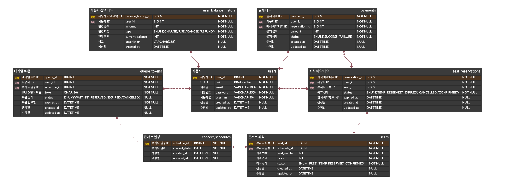

# ERD 설계

`콘서트 예약 서비스`의 요구사항을 기반으로 설계된 ERD입니다.

| Table                | Title     |
| -------------------- | --------- |
| users                | 사용자       |
| user_balance_history | 사용자 잔액 내역 |
| queue_tokens         | 대기열 토큰    |
| concert_schedules    | 콘서트 일정    |
| seats                | 콘서트 좌석    |
| seat_reservations    | 좌석 예약 내역  |
| payments             | 결제 내역     |





---


# 테이블 정보

## 사용자 : users

| 컬럼명        | 타입           | 설명     | Key | NULL |
| ---------- | ------------ | ------ | --- | ---- |
| user_id    | BIGINT       | 사용자 ID | PK  | NN   |
| uuid       | BINARY(16)   | UUID   | UNI | NN   |
| email      | VARCHAR(100) | 이메일    | UNI | NN   |
| password   | VARCHAR(255) | 비밀번호   |     | NN   |
| user_nm    | VARCHAR(50)  | 사용자 명  |     | NN   |
| created_at | DATETIME     | 생성일    |     |      |
| updated_at | DATETIME     | 수정일    |     |      |


```sql
CREATE TABLE users (
    user_id BIGINT AUTO_INCREMENT PRIMARY KEY COMMENT '사용자ID' ,
    uuid BINARY(16) NOT NULL UNIQUE COMMENT 'UUID',
    email VARCHAR(100) NOT NULL UNIQUE COMMENT '이메일',
    password VARCHAR(255) NOT NULL COMMENT '비밀번호',
    user_nm VARCHAR(50) NOT NULL COMMENT '사용자 명',
    created_at DATETIME DEFAULT CURRENT_TIMESTAMP COMMENT '생성일',
    updated_at DATETIME DEFAULT CURRENT_TIMESTAMP ON UPDATE CURRENT_TIMESTAMP COMMENT '수정일'
) COMMENT = '사용자';
```


## 사용자 잔액 내역 : user_balance_history

| 컬럼명                | 타입           | 설명           | Key                | NULL |
| ------------------ | ------------ | ------------ | ------------------ | ---- |
| balance_history_id | BIGINT       | 사용자 잔액 내역 ID | PK                 | NN   |
| user_id            | BIGINT       | 사용자 ID       | FK → users.user_id | NN   |
| amount             | INT          | 변경 금액        |                    | NN   |
| type               | ENUM         | 변경 타입        |                    | NN   |
| current_balance    | INT          | 현재 잔액        |                    | NN   |
| description        | VARCHAR(255) | 비고           |                    |      |
| created_at         | DATETIME     | 생성일          |                    |      |

| 값        | 의미                 |
| -------- | ------------------ |
| `CHARGE` | 잔액 충전              |
| `USE`    | 잔액 사용              |
| `CANCEL` | 취소 등으로 인한 잔액 복구    |
| `REFUND` | 결제 실패 등으로 인한 환불 처리 |

```sql
CREATE TABLE user_balance_history (
    balance_history_id BIGINT AUTO_INCREMENT PRIMARY KEY COMMENT '사용자 잔액 내역 ID',
    user_id BIGINT NOT NULL COMMENT '사용자 ID',
    amount INT NOT NULL COMMENT '변경 금액',
    type ENUM('CHARGE', 'USE', 'CANCEL', 'REFUND') NOT NULL COMMENT '변경 타입 (충전, 사용, 잔액 복구, 환불)',
    current_balance INT NOT NULL COMMENT '현재 잔액',
    description VARCHAR(255) COMMENT '비고',
    created_at DATETIME DEFAULT CURRENT_TIMESTAMP COMMENT '생성일',
    FOREIGN KEY (user_id) REFERENCES users(user_id)
) COMMENT = '사용자 잔액 내역';
```


##  대기열 토큰 : queue_tokens


| 컬럼명         | 타입       | 설명         | Key                                | NULL |
| ----------- | -------- | ---------- | ---------------------------------- | ---- |
| queue_id    | BIGINT   | 대기열 토큰 ID  | PK                                 | NN   |
| user_id     | BIGINT   | 사용자 ID     | FK → users.user_id                 | NN   |
| schedule_id | BIGINT   | 일정 ID      | FK → concert_schedules.schedule_id | NN   |
| token       | CHAR(36) | UUID 형식 토큰 | UNI                                | NN   |
| status      | ENUM     | 토큰 상태      |                                    | NN   |
| expires_at  | DATETIME | 토큰 만료일     |                                    | NN   |
| created_at  | DATETIME | 생성일        |                                    |      |
| updated_at  | DATETIME | 수정일        |                                    |      |

| 값          | 의미    |
| ---------- | ----- |
| `WAITING`  | 대기 중  |
| `RESERVED` | 예약 완료 |
| `EXPIRED`  | 만료    |
| `CANCELED` | 취소    |


```sql
CREATE TABLE queue_tokens (
    queue_id BIGINT AUTO_INCREMENT PRIMARY KEY COMMENT '대기열 토큰 ID',
    user_id BIGINT NOT NULL COMMENT '사용자 ID',
    schedule_id  BIGINT NOT NULL COMMENT '일정 ID',
    token CHAR(36) NOT NULL UNIQUE COMMENT 'UUID 형식 토큰',
    status ENUM('WAITING', 'RESERVED', 'EXPIRED', 'CANCELED') DEFAULT 'WAITING' COMMENT '토큰 상태 (대기 중, 예약 완료, 만료, 취소)',
    expires_at DATETIME NOT NULL COMMENT '토큰 만료일',
    created_at DATETIME DEFAULT CURRENT_TIMESTAMP COMMENT '생성일',
    updated_at DATETIME DEFAULT CURRENT_TIMESTAMP ON UPDATE CURRENT_TIMESTAMP COMMENT '수정일',
    FOREIGN KEY (user_id) REFERENCES users(user_id),
    FOREIGN KEY (schedule_id) REFERENCES concert_schedules(schedule_id)
) COMMENT = '대기열 토큰';
```


##  콘서트 일정 : concert_schedules

| 컬럼명          | 타입       | 설명        | Key                      | NULL |
| ------------ | -------- | --------- | ------------------------ | ---- |
| schedule_id  | BIGINT   | 콘서트 일정 ID | PK                       | NN   |
| concert_date | DATE     | 콘서트 날짜    |                          | NN   |
| created_at   | DATETIME | 생성일       |                          |      |
| updated_at   | DATETIME | 수정일       |                          |      |


```sql
CREATE TABLE concert_schedules (
    schedule_id BIGINT AUTO_INCREMENT PRIMARY KEY COMMENT '콘서트 일정 ID',
    concert_date DATE NOT NULL COMMENT '콘서트 날짜',
    created_at DATETIME DEFAULT CURRENT_TIMESTAMP COMMENT '생성일',
    updated_at DATETIME DEFAULT CURRENT_TIMESTAMP ON UPDATE CURRENT_TIMESTAMP COMMENT '수정일'
) COMMENT = '콘서트 일정';
```


##  콘서트 좌석 : seats

| 컬럼명         | 타입       | 설명        | Key                                | NULL |
| ----------- | -------- | --------- | ---------------------------------- | ---- |
| seat_id     | BIGINT   | 콘서트 좌석 ID | PK                                 | NN   |
| schedule_id | BIGINT   | 콘서트 일정 ID | FK → concert_schedules.schedule_id | NN   |
| seat_number | INT      | 좌석 번호     |                                    | NN   |
| price       | INT      | 좌석 가격     |                                    | NN   |
| status      | ENUM     | 콘서트 좌석 상태 |                                    | NN   |
| created_at  | DATETIME | 생성일       |                                    |      |
| updated_at  | DATETIME | 수정일       |                                    |      |

| 값               | 의미    |
| --------------- | ----- |
| `FREE`          | 예약 가능 |
| `TEMP_RESERVED` | 임시 예약 |
| `CONFIRMED`     | 예약 확정 |


```sql
CREATE TABLE seats (
    seat_id BIGINT AUTO_INCREMENT PRIMARY KEY COMMENT '콘서트 좌석 ID',
    schedule_id BIGINT NOT NULL COMMENT '콘서트 일정 ID',
    seat_number INT NOT NULL COMMENT '좌석 번호',
    price INT NOT NULL COMMENT '좌석 가격',
    status ENUM('FREE', 'TEMP_RESERVED', 'CONFIRMED') NOT NULL DEFAULT 'FREE' COMMENT '콘서트 좌석 상태 (예약가능, 임시 예약, 예약 확정)',
    created_at DATETIME DEFAULT CURRENT_TIMESTAMP COMMENT '생성일',
    updated_at DATETIME DEFAULT CURRENT_TIMESTAMP ON UPDATE CURRENT_TIMESTAMP COMMENT '수정일',
    FOREIGN KEY (schedule_id) REFERENCES concert_schedules(schedule_id)
) COMMENT = '콘서트 좌석';
```


## 좌석 예약 내역 : seat_reservations

| 컬럼명            | 타입       | 설명                          | Key                | NULL |
| -------------- | -------- | --------------------------- | ------------------ | ---- |
| reservation_id | BIGINT   | 좌석 예약 내역 ID                 | PK                 | NN   |
| user_id        | BIGINT   | 사용자 ID                      | FK → users.user_id | NN   |
| seat_id        | BIGINT   | 좌석 ID                       | FK → seats.seat_id | NN   |
| status         | ENUM     | 예약 상태                       |                    | NN   |
| expired_at     | DATETIME | 임시 예약 만료 시각<br>(예약 취소 시 해제) |                    |      |
| created_at     | DATETIME | 생성일(예약일)                    |                    |      |
| updated_at     | DATETIME | 수정일                         |                    |      |

|값|의미|
|---|---|
|`TEMP_RESERVED`|임시 예약|
|`EXPIRED`|만료|
|`CANCELLED`|취소|
|`CONFIRMED`|예약 확정|


```sql
CREATE TABLE seat_reservations (
    reservation_id BIGINT AUTO_INCREMENT PRIMARY KEY COMMENT '좌석 예약 내역 ID',
    user_id BIGINT NOT NULL COMMENT '사용자 ID',
    seat_id BIGINT NOT NULL COMMENT '좌석 ID',
    status ENUM('TEMP_RESERVED', 'EXPIRED', 'CANCELLED', 'CONFIRMED') NOT NULL COMMENT '예약 상태 (임시 예약, 만료, 취소, 예약 확정)',
    expired_at DATETIME COMMENT '임시 예약 만료 시각',
    created_at DATETIME DEFAULT CURRENT_TIMESTAMP COMMENT '생성일(예약일)',
    updated_at DATETIME DEFAULT CURRENT_TIMESTAMP ON UPDATE CURRENT_TIMESTAMP COMMENT '수정일',
    FOREIGN KEY (user_id) REFERENCES users(user_id),
    FOREIGN KEY (seat_id) REFERENCES seats(seat_id)
) COMMENT = '좌석 예약 내역';

```


## 결제 내역 : payments

|컬럼명|타입|설명|Key|NULL|
|---|---|---|---|---|
|payment_id|BIGINT|결제 내역 ID|PK|NN|
|user_id|BIGINT|사용자 ID|FK → users.user_id|NN|
|reservation_id|BIGINT|예약 ID|FK → seat_reservations.reservation_id|NN|
|amount|INT|결제 금액||NN|
|status|ENUM|결제 상태||NN|
|created_at|DATETIME|생성일|||
|updated_at|DATETIME|수정일|||

|값|의미|
|---|---|
|`SUCCESS`|결제 성공|
|`FAILURE`|결제 실패|


```sql
CREATE TABLE payments (
    payment_id BIGINT AUTO_INCREMENT PRIMARY KEY COMMENT '결제 내역 ID',
    user_id BIGINT NOT NULL COMMENT '사용자 ID',
    reservation_id BIGINT NOT NULL COMMENT '예약 ID',
    amount INT NOT NULL COMMENT '결제 금액',
    status ENUM('SUCCESS', 'FAILURE') NOT NULL COMMENT '결제 상태(성공, 실패)',
    created_at DATETIME DEFAULT CURRENT_TIMESTAMP COMMENT '생성일',
    updated_at DATETIME DEFAULT CURRENT_TIMESTAMP ON UPDATE CURRENT_TIMESTAMP COMMENT '수정일',
    FOREIGN KEY (user_id) REFERENCES users(user_id),
    FOREIGN KEY (reservation_id) REFERENCES seat_reservations(reservation_id)
) COMMENT = '결제 내역';

```


