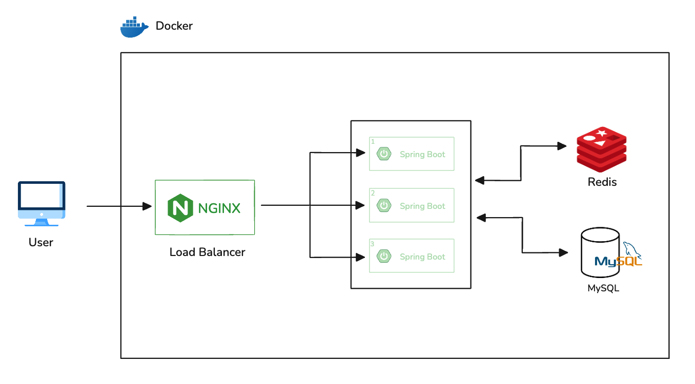

# 인프라 구성도
- **Docker 기반 인프라**에서 서비스 전체를 컨테이너로 구성하였습니다.

# 구성 요소

##  Docker

- 전체 시스템을 컨테이너 기반으로 운영합니다.
- 각각의 구성 요소(Nginx, Spring Boot, Redis, MySQL)는 개별 Docker 컨테이너로 실행됩니다.

##  NginX (Load Balancer)

- 사용자의 요청을 받아 내부 Spring Boot 애플리케이션 인스턴스에 로드 밸런싱합니다.
- 각 인스턴스에 트래픽을 균등하게 분산시켜 **부하 분산 및 고가용성**을 보장합니다.

##  Spring Boot  애플리케이션

- 각각 독립적인 Spring Boot 인스턴스로서, 컨테이너로 실행됩니다.
- 동일한 애플리케이션의 복수 인스턴스로 **무중단 배포(blue-green)** 또는 **오토스케일링**이 가능하도록 구성되어 있습니다.
- 각각은 Redis와 MySQL에 접근하여 필요한 데이터를 처리합니다.

##  Redis

- 인메모리 캐시 데이터베이스로 사용됩니다.
- 주 용도:
    - 세션 저장
    - 임시 데이터 캐싱
    - 대기열 처리(좌석 임시 예약)
- Spring Boot 인스턴스에서 접근하여 상태를 공유할 수 있습니다.

##  MySQL

- 서비스의 주요 데이터를 저장하는 RDBMS

